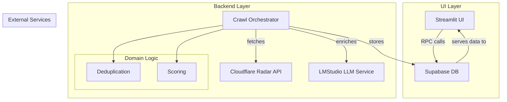
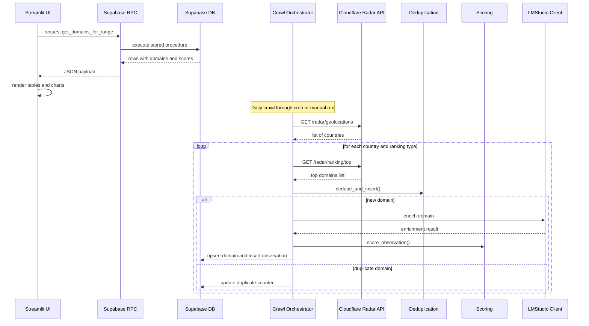
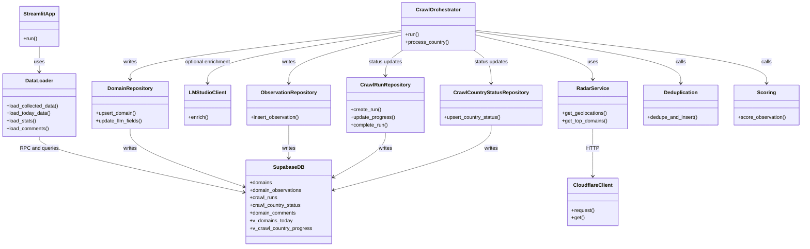
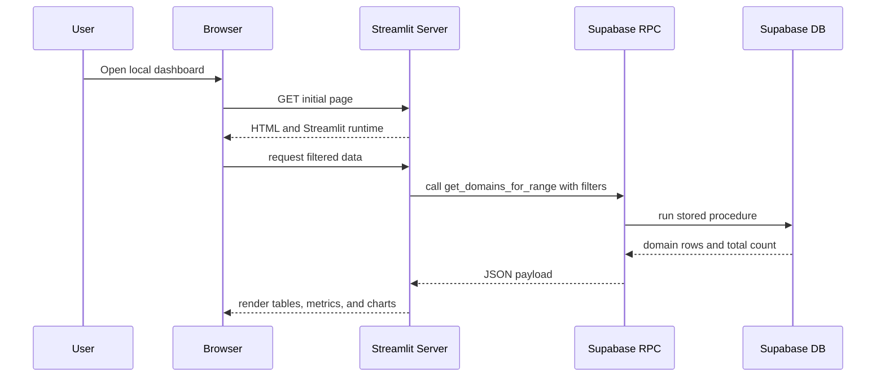
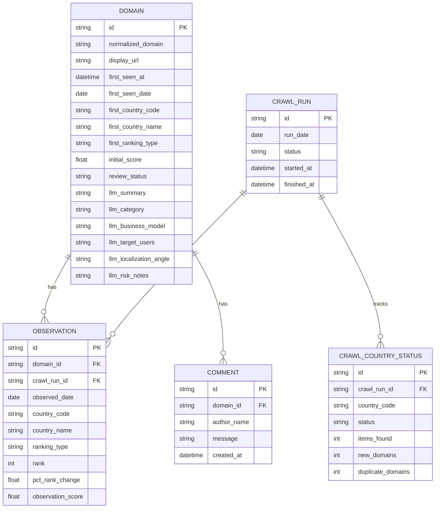
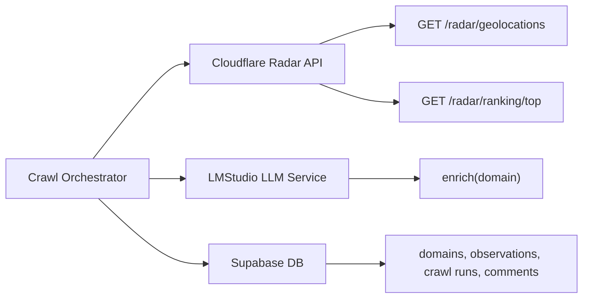
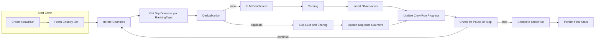
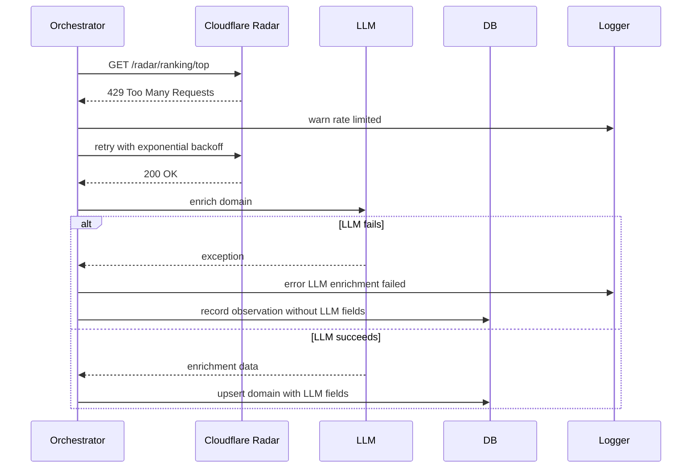

# Architecture Overview

## 1. High-Level System Diagram

**Explanation:** The UI (Streamlit) talks directly to Supabase via RPCs. A daily crawl job (`Crawl Orchestrator`) pulls data from Cloudflare, optionally enriches it with an LLM, processes domains through deduplication and scoring, and persists everything in Supabase.

## 2. Main Data Flow Diagram

**Explanation:** The UI layer reads pre-computed data from Supabase. The crawler pulls raw data from Cloudflare, deduplicates domains, runs LLM enrichment when configured, scores observations, and writes the results back to Supabase.

## 3. Component / Module Diagram

**Explanation:** This diagram shows the main Python modules and their responsibilities, plus the Supabase persistence layer.

## 4. Sequence Diagram - Main User Flow (Dashboard Load)

**Explanation:** When a user opens the dashboard, Streamlit serves the page, fetches domain data via Supabase RPC, and renders the UI components.

## 5. Database Diagram

**Explanation:** This diagram lists the primary Supabase tables and their relationships.

## 6. External Services Diagram

**Explanation:** Cloudflare provides ranking and geolocation data. LMStudio provides optional LLM enrichment. Supabase stores the processed results.

## 7. Detailed Crawl Pipeline Diagram

**Explanation:** This shows each step of the daily crawl, including conditional LLM enrichment only for new domains and progress tracking.

## 8. Error Handling & Retry Diagram

**Explanation:** The orchestrator uses retry logic for Cloudflare calls. LLM enrichment failures are logged and the observation is still stored without LLM fields.

---

All diagrams are Mermaid-compatible and can be rendered independently by a Markdown documentation pipeline.
